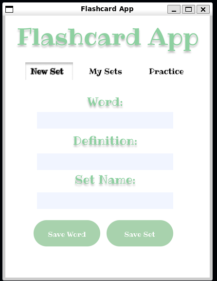
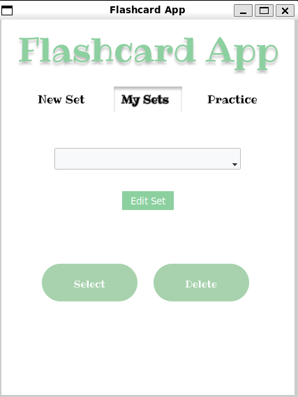
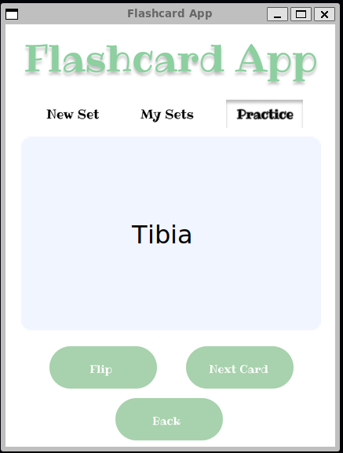
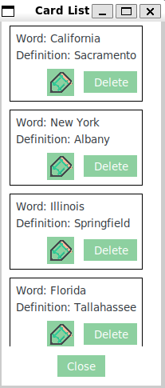
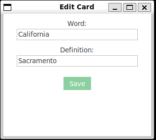

# 🧠 Flashcard Study App

An interactive flashcard study app built with Python and Tkinter. Create custom flashcard sets, practice them with animated transitions, and manage your cards easily with edit and delete functionality.

---

## ✨ Features

- Create, edit, and delete flashcard sets  
- Add and manage cards with word/definition pairs  
- Study with animated flashcards (flip effect)  
- Browse and edit cards in scrollable popup lists  
- Persistent local storage using SQLite  
- Polished GUI using `tkinter` and image-based navigation  

---
## 🖥️ Screenshots

| New Set | My Sets | Practice |
|---------|---------|----------|
|  |  |  |
| Sets List | Edit Card |
|  |  |
---

## 🚀 How to Use

1. Clone the repository:
   bash
  <pre>git clone https://github.com/kavancamp/flashcard_study_app.git
cd flashcard_study_app</pre>
2. Run the app:
   bash
  <pre>python window.py</pre>

### 🛠️ For testing purposes:

Run this once to populate your database:
<pre>
python seed_data.py
</pre>

## 📁 Project Structure
<pre>
flashcard-study-app/
├── assets/               # Images used in the UI
│   └── ...
├── data/
│   └── flashcards.db     # SQLite database file
├── window.py             # Main application code
├── database.py           # Database handling logic
├── seed_data.py          # Optional: seed example data
└── README.md

   ## 🔧 Requirements

- Python 3.8+  
- tkinter
- SQLite3 (comes with Python)
